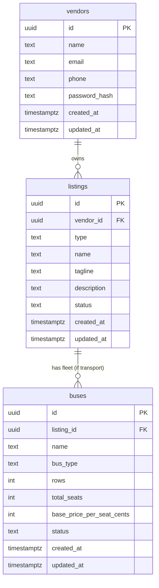

# Database design — clean & simple

Use this as the single source of truth for the Vendor Hub database. Share with Lovable, backend AI, or new developers.

---

## Core concept

1. **Vendor** = person (can own multiple businesses).
2. **Listing** = one company/business.
3. One vendor → many listings.
4. If listing **type = transport** → that listing can have **multiple buses**.
5. Each bus has its own layout and pricing.

**Hierarchy:** Vendor (person) → Listing (company) → Bus (fleet item, only when type = transport).

No extra tables for this core. Keep it simple and scalable.

---

## 1. Vendors table

**Vendor = person** (business owner).

| Field          | Type      | Notes                    |
|----------------|-----------|--------------------------|
| id             | UUID      | Primary key              |
| name           | text      | Person name              |
| email          | text      | Unique, not null         |
| phone          | text      | Optional                 |
| password_hash  | text      | Not null                 |
| created_at     | timestamptz | Default now()          |
| updated_at     | timestamptz | Default now()          |

- One vendor can own **multiple listings** (via `listings.vendor_id`).
- No `business_name`, `plan`, or `verified` — vendor is the person; company name lives on each **listing**.

---

## 2. Listings table (company level)

**Each row = one company/business** owned by a vendor.

| Field               | Type      | Notes |
|---------------------|-----------|--------|
| id                  | UUID      | Primary key |
| vendor_id           | UUID      | FK → vendors.id, not null |
| type                | text      | restaurant \| hotel \| shop \| **transport** \| experience \| rental \| event \| guide \| emergency |
| name                | text      | Business/company name, not null |
| tagline             | text      | Optional |
| description         | text      | Optional |
| registered_address  | text      | For transport (e.g. head office) |
| service_area        | text      | For transport (e.g. operating region) |
| address             | text      | For non-transport |
| city                | text      | For non-transport |
| cover_image_url     | text      | Optional |
| status              | text      | draft \| pending_approval \| live |
| created_at          | timestamptz | |
| updated_at          | timestamptz | |

**Rules:**

- One vendor → many listings.
- One listing = one company.
- **Only listings with type = transport can have buses.** (Enforced in API, not DB constraint.)

---

## 3. Buses table (only for transport listings)

**Each row = one physical bus** under a transport company (listing).

| Field                      | Type    | Notes |
|----------------------------|---------|--------|
| id                         | UUID    | Primary key |
| listing_id                 | UUID    | FK → listings.id, not null, on delete cascade |
| name                       | text    | e.g. "Volvo 12", not null |
| bus_type                   | text    | seater \| sleeper \| semi_sleeper |
| layout_type                | text    | 2+2 \| 2+1 \| sleeper \| custom |
| rows                       | int     | 1–50 |
| left_cols                  | int     | 0–5 |
| right_cols                 | int     | 0–5 |
| has_aisle                  | boolean | Default true |
| total_seats                | int     | Computed: rows × (left_cols + right_cols), 1–100 |
| base_price_per_seat_cents  | int     | ≥ 0 |
| status                     | text    | active \| inactive |
| created_at                 | timestamptz | |
| updated_at                 | timestamptz | |

**Rules:**

- One transport listing → many buses.
- `total_seats` must be recalculated whenever layout (rows, left_cols, right_cols) changes.
- Buses cannot exist without a listing; **if listing is deleted → buses are deleted (cascade)**.
- Bus create/update/delete allowed only when `listing.type = 'transport'` (enforced in API).

---

## 4. Design constraints

- **Bus operations** allowed only when `listing.type = 'transport'`. All bus APIs check this and `listings.vendor_id = current vendor`.
- **All listing queries** must filter by `vendor_id` so a vendor only sees and edits their own listings.
- Keep the model **modular** so you can add routes, bookings, seat reservations later without changing this core.

Do **not** put bus-level data (rows, seats, price) on the listings table; keep listing = company only.

---

## 5. Future-ready (not implemented yet)

Design so these can be added later without redesign:

- **routes** table (e.g. route per bus or per listing).
- **bookings** table (customer bookings).
- **seat_reservations** or similar.

Do **not** implement them until needed. Keep the current system to: **Vendor → Listing → Bus** (when transport).

---

## Visual hierarchy

```
┌─────────────────────────────────────────────────────────────────┐
│  VENDOR (person)                                                 │
│  id, name, email, phone, password_hash                           │
└────────────────────────────┬────────────────────────────────────┘
                             │ owns (1 → many)
                             ▼
┌─────────────────────────────────────────────────────────────────┐
│  LISTING (company / business)                                    │
│  id, vendor_id, type, name, tagline, description, location, …   │
│  type ∈ { transport, restaurant, hotel, shop, … }               │
└────────────────────────────┬────────────────────────────────────┘
                             │ if type = transport only (1 → many)
                             ▼
┌─────────────────────────────────────────────────────────────────┐
│  BUS (fleet item)                                                │
│  id, listing_id, name, bus_type, layout, rows, cols,             │
│  total_seats, base_price_per_seat_cents, status                  │
└─────────────────────────────────────────────────────────────────┘
```

**Mermaid (for GitHub / Confluence):**



---

## Final structure (logic only)

```
Vendor (person)
  ↓ owns
Listing (company/business)
  ↓ if type = transport, has many
Bus (fleet item)
```

Nothing more complicated than this for the core.

---

## Current schema files (run order)

1. `000_drop_all_vendor_tables.sql` — drops drivers, buses, listings, vendors (clean slate)
2. `001_vendors.sql` — vendors (id, name, email, phone, password_hash, created_at, updated_at)
3. `002_listings.sql` — listings (company-level; vendor_id, type, name, tagline, description, registered_address, service_area, address, city, cover_image_url, status, created_at, updated_at)
4. `003_buses.sql` — buses (listing_id, name, bus_type, layout_type, rows, left_cols, right_cols, has_aisle, total_seats, base_price_per_seat_cents, status, created_at, updated_at)
5. `004_drivers.sql` — drivers (listing_id, name, phone, license_no, created_at, updated_at)

Run with: `npm run db:init` from `vendor-hub-main/backend`.
